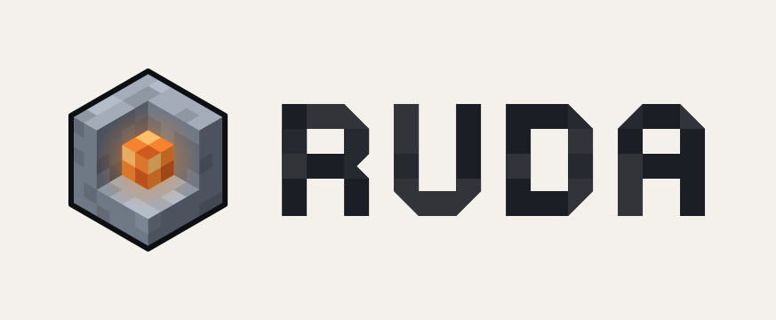

<p align="center">
  <picture>
    <source media="(prefers-color-scheme: dark)" srcset="assets/branding/logo-dark.svg">
    
  </picture>
</p>

Ruda is a voxel sandbox game in the spirit of Minecraft, written in Rust.

What we're aiming for:

- multiplayer from the start, with single-player running on a built-in local server;
- smooth play on weak hardware, with a Raspberry Pi 4 as the low bar;
- a modding API that can carry big tech mods: machines, power networks, their own UIs.

It's very early. You can fly around a generated world with hills, rocky
mountains, caves and ore, break and place blocks, and light caves with lamps and torches. Days and nights pass
every 20 minutes, light spreads from the sky and from glowing blocks in colour,
and corners are softly shaded. Blocky clouds drift with the wind at the height
of the mountain tops, slowly form and fade away, thin out around the peaks
and shade the ground. The world is endless sideways and 256 blocks
tall, from −128 to +127, with sea level at 0 and unbreakable bedrock at the
bottom. Single-player already runs on a local server
inside the game; there's no survival, saving or network play yet.

## Building

Install Rust with [rustup](https://rustup.rs). The toolchain pinned in
`rust-toolchain.toml` is picked up automatically.

```sh
cargo run -p ruda          # client
cargo run -p ruda-server   # dedicated server (a stub until network play lands)
```

The game opens on the main menu. Settings has the view distance, how far
simplified far terrain reaches beyond it, field of view, vertical sync,
fullscreen, clouds, sun shadows (off by default: they cost a
second drawing of the world), graphics API and language (English or
Russian; the system language by default). They are saved to `settings.toml`
in `~/.config/ruda` on Linux, `~/Library/Application Support/Ruda` on macOS
and `%APPDATA%\Ruda` on Windows.

In the game:

| Key | Action |
|---|---|
| Mouse | Look around |
| W A S D | Fly |
| Space / Left Shift | Up / down |
| Left Ctrl | Fly faster |
| Left / right click | Break / place a block |
| 1–9, 0, mouse wheel | Pick the block to place |
| Esc | Pause menu |

The client takes a few options:

- `--singleplayer` skips the menu and starts a world right away.
- `--seed <N>` picks the world; without it every start is a new world.
- `--time <TICKS>` starts at a time of day: 0 is sunrise, 6000 noon, 12000
  sunset and 18000 midnight.
- `--view-distance <CHUNKS>` overrides how far the world loads, in chunks of 32
  blocks, up to 32 (6 by default; try 2 or 3 on weak hardware).
- `--lod-distance <BLOCKS>` overrides how far simplified far terrain
  reaches past the chunks drawn in full; 0 turns it off.
- `--gpu-backend <auto|vulkan|metal|dx12|gl>` overrides the graphics API. You
  can also set it with `RUDA_GPU_BACKEND`. `auto` tries Vulkan, Metal and DX12
  before falling back to OpenGL.
- `--camera <X,Y,Z[,YAW,PITCH]>` starts the camera at a given point instead
  of the spawn point, angles in degrees.
- `--exit-after-frames <N>` quits after N frames have been shown, and
  `--screenshot <PATH>` saves the last one. CI uses them as a smoke test.
- `--benchmark <SECONDS>` starts a world, waits until it has loaded, then
  measures frame times for that long and prints them. Add `--no-vsync` to
  draw as fast as possible, `--shadows` to turn sun shadows on, `--no-clouds`
  to turn clouds off, and `--seed` and `--camera` to measure the same view
  every time.

Logging is controlled with `RUST_LOG`, for example `RUST_LOG=debug`. To profile
with [Tracy](https://github.com/wolfpld/tracy), build with `--features tracy`.

## Platforms

CI builds Ruda for Windows, macOS and Linux, on both x86_64 and ARM. The
renderer needs a GPU with Vulkan, Metal or DX12, or at least OpenGL 3.3 /
OpenGL ES 3.0.

## Contributing

See [CONTRIBUTING.md](CONTRIBUTING.md).

## License

Apache-2.0, see [LICENSE](LICENSE). If you fork Ruda, keep the attribution
from [NOTICE](NOTICE).

Block textures are from [Isabella II](https://github.com/minetest-texture-packs/Isabella-II)
by Bonemouse, licensed under CC BY 3.0, and the interface font is
[Pixelify Sans](https://github.com/eifetx/Pixelify-Sans), licensed under the SIL
Open Font License 1.1; see [assets/CREDITS.md](assets/CREDITS.md).
