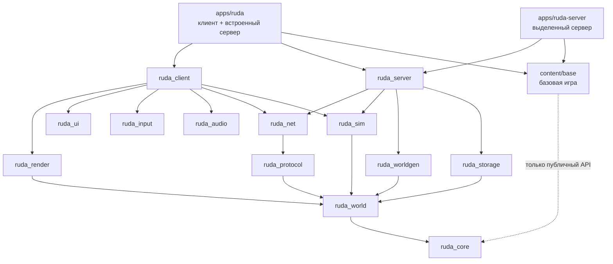
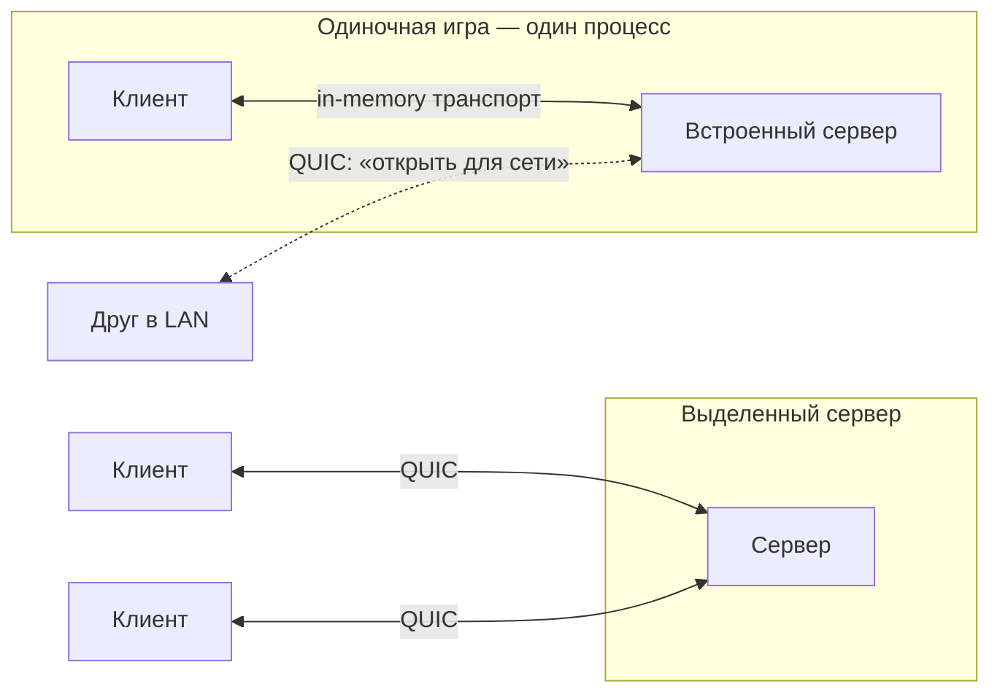
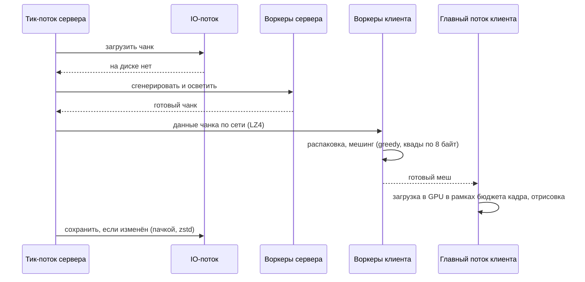

# Обзор архитектуры

Здесь общая картина. Детали и обоснования — в [ADR](adr/README.md).

## Крейты и зависимости

Граница проходит так: всё, от чего зависит `ruda_server`, собирается без `wgpu`, `winit` и звука.
Это проверяет CI (ADR-0002).

## Процессы и соединения

## Жизненный цикл чанка

## Потоки

| Где | Поток | Что делает |
|---|---|---|
| Сервер | Тик (20 TPS) | Единственный меняет мир; выполняет расписание систем ECS |
| Сервер | Пул воркеров | Генерация, освещение, сжатие |
| Сервер | IO | Хранилище |
| Оба | Сеть (tokio) | QUIC |
| Клиент | Главный | События окна, ввод, логика 20 Гц с интерполяцией, рендер |
| Клиент | Пул воркеров | Распаковка, мешинг |

В одиночной игре пул воркеров общий (ADR-0012).
